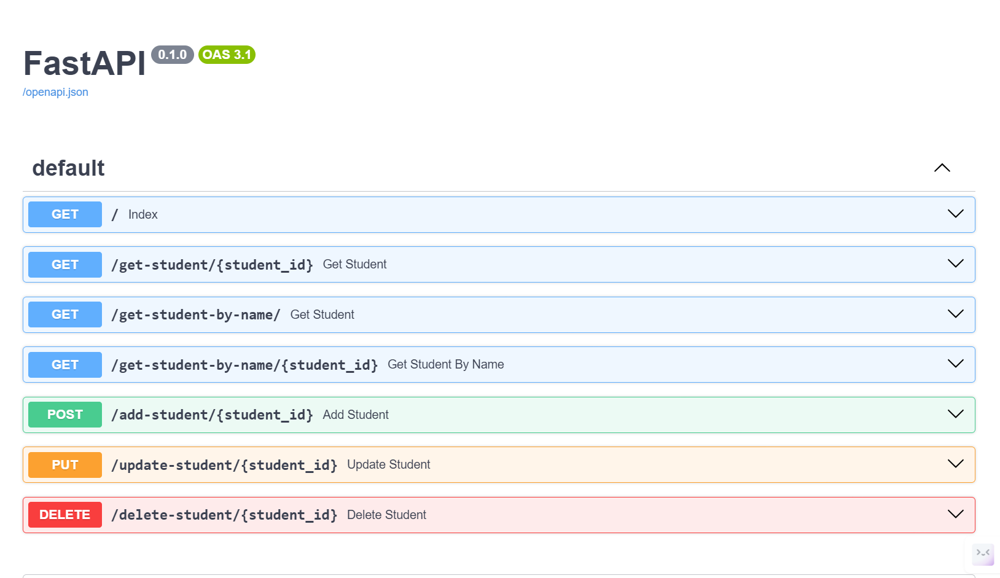

# FastAPI Notes & Reference Guide
FastAPI is a modern, fast (high-performance) web framework for building APIs with Python 3.7+ based on standard Python type hints.

Official Documentation: [FastAPI](https://fastapi.tiangolo.com/)

<hr>

### 1. Installation
#### Install FastAPI:
```
pip install fastapi
```
#### Install `uvicorn` (ASGI server for FastAPI):
```
pip install uvicorn
```

####  Check Python Environment:
Ensure you are in the correct Python environment (especially if you’re using a virtual environment). To activate your virtual environment:

```
# For Windows:
.\venv\Scripts\activate

# For macOS/Linux:
source venv/bin/activate
```

### 2. Running the FastAPI Application
To run your FastAPI app:

#### Basic Python Run:
```
python <filename>.py
```
Running the App with Uvicorn (server side):
```
uvicorn <filename>:app --reload
```
* `--reload`: Enables auto-reload when code changes, useful during development.

### 3. API Documentation with Swagger UI
FastAPI automatically generates interactive API docs:

* Swagger UI: Available at http://127.0.0.1:8000/docs after running the app.
    * This provides a detailed GUI that documents and allows interaction with each endpoint in your API.
* Alternative API docs: FastAPI also provides a ReDoc documentation interface at http://127.0.0.1:8000/redoc.

### 4. Core Concepts & HTTP Methods
#### 1. GET Request: Fetch Data
* Use GET to retrieve data from the server. Here’s an example of fetching a student’s data:
````
@app.get("/get-student/{student_id}")
def get_student(student_id: int):
    return students.get(student_id, {"message": "Student not found"})
````

**Path Parameters**: `student_id` is a dynamic value passed via the URL. Path parameters are used to retrieve specific resources.

#### 2. POST Request: Add Data
* Use POST to send data to the server and create a new resource. Example of adding a new student:
```
@app.post("/add-student/{student_id}")
def add_student(student_id: int, name: str, age: int, class_name: str):
    students[student_id] = {"name": name, "age": age, "class": class_name}
    return {"message": "Student added successfully"}
```
#### 3. PUT Request: Update Data
* Use PUT to update an existing resource. Example of updating a student's data:

```
@app.put("/update-student/{student_id}")
def update_student(student_id: int, name: Optional[str], age: Optional[int], class_name: Optional[str]):
    if student_id not in students:
        return {"message": "Student not found"}
    if name:
        students[student_id]["name"] = name
    if age:
        students[student_id]["age"] = age
    if class_name:
        students[student_id]["class"] = class_name
    return {"message": "Student updated successfully"}
```

#### 4. DELETE Request: Remove Data
* Use DELETE to remove a resource from the server. Example of deleting a student:
```
@app.delete("/delete-student/{student_id}")
def delete_student(student_id: int):
    if student_id in students:
        del students[student_id]
        return {"message": "Student deleted successfully"}
    return {"message": "Student not found"}
```

5. Using Path Parameters

<h3>Dynamic URL Parameters:</h3>

* Path parameters allow you to pass dynamic values via the URL. For example, `/get-student/{student_id}` dynamically accepts `student_id`.

```
@app.get("/get-student/{student_id}")
def get_student(student_id: int):
    return students.get(student_id, {"message": "Student not found"})
```

* In the example, the `{student_id}` is dynamic, meaning any number passed in the URL (e.g., `/get-student/1`) will be processed by the function.

<h3>Path Parameter Validation:</h3>
* You can use `Path()` to add metadata, default values, and validations to path parameters.

```
@app.get("/get-student/{student_id}")
def get_student(student_id: int = Path(..., description="The ID of the student to retrieve", ge=1)):
    return students.get(student_id, {"message": "Student not found"})
```
* `ge=1`: Ensures that the `student_id` must be greater than or equal to 1.
* `description`: Adds a description to the parameter for documentation purposes.

#### 6. Query Parameters
* Query parameters allow you to filter or modify requests based on certain criteria while staying on the same endpoint. They are typically appended to the URL after a `?`.

Example of using a query parameter to filter data:
```
@app.get("/get-student-by-name/")
def get_student(name: str):
    for student_id in students:
        if students[student_id]["name"] == name:
            return students[student_id]
    return {"data": "Student not found"}
```
* In this example, you can access the student by navigating to `/get-student-by-name/?name=John`, allowing you to query based on the `name` parameter.

#### 7. API Error Handling
Raise `HTTPException`:<br>
FastAPI allows you to raise exceptions for handling errors:
```
from fastapi import HTTPException

@app.get("/get-student/{student_id}")
def get_student(student_id: int):
    if student_id not in students:
        raise HTTPException(status_code=404, detail="Student not found")
    return students[student_id]
```
* `HTTPException`: Sends an error response with a status code and message if something goes wrong (e.g., student not found).

#### 8. Interactive API Testing
* Swagger UI allows you to test your API endpoints directly in the browser. Simply navigate to http://127.0.0.1:8000/docs to see and interact with each method (GET, POST, PUT, DELETE) you’ve defined.

#### 9. Final Tips
* Use Uvicorn for development: It's highly recommended to use `uvicorn` with the `--reload` option during development for auto-reloading when you make changes.
* Testing API Endpoints: While you can use tools like Postman, FastAPI’s built-in Swagger UI is a powerful way to test endpoints quickly.
* Validation: FastAPI provides automatic validation based on Python type hints (`int`,`str`, etc.).

#### 10. Common Commands
* Start FastAPI with Uvicorn:
```
uvicorn <filename>:app --reload
```
* Access Swagger UI: http://127.0.0.1:8000/docs

* Access Alternative ReDoc: http://127.0.0.1:8000/redoc

#### 11. Further Reading and Learning
* Official FastAPI Documentation: https://fastapi.tiangolo.com/
* Uvicorn Documentation: https://www.uvicorn.org/

