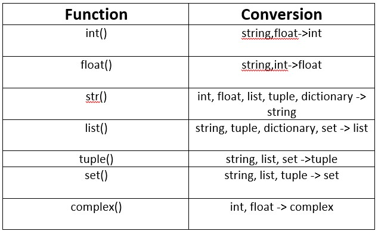

# [Python](https://www.python.org/)

### [Beginner's Guide to Python](https://wiki.python.org/moin/BeginnersGuide)

---

## Basics
- **Variables:** Names pointing to data in memory; identifiers are variable names.
- **Data Types:** `int`, `str`, `bool`, `None`, `float`. Use `type(var)` to check type.  
- **Case Sensitive:** `name` and `Name` are different.
- **Arithmetic Operators:**
  - `/` (division): `5 / 2 = 2.5`
  - `%` (modulus): `5 % 2 = 1`
  - `**` (power): `5 ** 2 = 25`
- **Type Conversion:**
  - **Automatic (Implicit / Conversion):** Done by Python interpreter.
  - **Manual (Casting):** Programmer uses `int()`, `float()`, etc.  
  - [Learn More](https://www.scaler.com/topics/python/explicit-type-conversion-in-python/)  

<div style="text-align: center;">
    
</div>


## Strings
- **Concatenation:** `str1 + str2 → str1str2`
- **Length:** `len(string)`
- **Escape Sequences:**  
    - `\'` → Single-quote  
    - `\"` → Double-quote  
    - `\n` → Newline  
    - `\t` → Tab  
    - `\b` → Backspace  
    - `\\` → Backslash  
    - `\f` → Form-feed  
    - `\ooo` → Octal  
    - `\xhh` → Hexadecimal  

- **Indexing & Slicing:**
  - Positive: `str[1:4] → chars 1 to 3`
  - Negative: `str[-3:-1] → reverse slice`
- **Key Functions:**
  - `str.endswith("er")` → checks suffix.
  - `str.capitalize()` → first letter capitalized.
  - `str.replace("old", "new")` → replace substrings.
  - `str.find("word")` → index of first occurrence.
  - `str.count("am")` → counts occurrences.


## Lists
- **Syntax:** `[ ]`  
- **Key Points:** Stores multiple data types, mutable, slicing like strings.
- **Key Functions:**
  - `list.append()` → adds at the end.
  - `list.sort()` → ascending order.
  - `list.sort(reverse=True)` → descending order.
  - `list.reverse()` → reverses list.
  - `list.insert(idx, el)` → insert at `idx`.
  - `list.remove(idx)` → remove at `idx`
  - `list.pop()` → removes last element.
- **Note:** `reverse()` modifies list; `sort()` creates new one(copy).


## Tuples
- **Syntax:** `( )`  
- **Key Points:** Immutable, mixed types, slicing works.  
- **Key Functions:** 
  - `tup.index(ele)` → index of first occurrence.  
  - `tup.count(ele)` → frequency of element.  
- **Note:** `(1,)` is tuple; `(1)` is integer. (1) is an integer class, (1.0) is a float class, ("str") is string but (1,) or ("str",) is class tuple 

## Dictionaries
- **Syntax:** `{key: value}`
- **Key Points:** Unordered, mutable, no duplicate keys.  
- **Key Functions:**
  - `dict.keys()` → all keys.
  - `dict.values()` → all values.
  - `dict.items()` → `(key, value)` pairs.
  - `dict.get("key")` → value (returns `None` if key missing).  
  - `dict.update(newDict)` → updates/merges dictionaries.  
- **Note:** Accessing missing key:
  - `dict[key]` → Error.
  - `dict.get(key)` → Returns `None`. 
- Empty dictonary syntax, `collection = {}`

## Set
- **Syntax:** `{ }`  
- **Key Points:** Unordered, unique items, immutable elements.  
- **Operations:**
  - `set.add(ele)` → adds element.
  - `set.remove(ele)` → removes element.
  - `set.clear()` → empties set.
  - `set.union()` → combines sets.
  - `set.intersection()` → common elements.
- **Empty Set:** `set()` (not `{}`).  
- **Note:** Only immutable types allowed (e.g., tuples, not lists).  
- `Values = {9,9.0,9.25}` ~ `{9,9.25}` - it will treat  `9` & `9.0` as same and remove dublicates but this will work if its `{9,"9.0"}`


## **Key Takeaways**
- Strings are **immutable**; lists are **mutable**.  
- Sets remove duplicates; e.g., `{9, 9.0}` becomes `{9}`.  
- Dictionaries are accessed using `keys`, values retrieved using `dict[key]` or `dict.get(key)`.  
- Tuples are immutable; to create one element tuple, use `(1,)`.  

<br>
<br>

# Table of Comparison

| **Type**        | **Representation** | **Unique**         | **Mutable/Immutable** | **Ordered/Unordered** | **Functions**                                                                                           | **Facts/Important Points**                          |
|------------------|--------------------|--------------------|------------------------|------------------------|---------------------------------------------------------------------------------------------------------|---------------------------------------------------|
| **String**       | `" "` or `' '`     | No                 | Immutable              | Ordered                | `len()`, `capitalize()`, `replace()`, `find()`, `count()`, `split()`, `join()`, `strip()`, `startswith()` | Supports slicing, sequence of characters.         |
| **List**         | `[ ]`             | No                 | Mutable                | Ordered                | `append()`, `sort()`, `reverse()`, `insert()`, `pop()`, `remove()`, `index()`, `count()`, `extend()`, `copy()` | Stores multiple data types, mutable, slicing supported. |
| **Tuple**        | `( )`             | No                 | Immutable              | Ordered                | `index()`, `count()`, `len()`, `max()`, `min()`, `sum()`                                               | Use `(1,)` for single-element tuple; slicing works. |
| **Dictionary**   | `{key: value}`    | Keys Only          | Mutable                | Unordered              | `keys()`, `values()`, `items()`, `get()`, `pop()`, `update()`, `setdefault()`, `clear()`, `copy()`      | Keys must be unique; provides fast lookups.       |
| **Set**          | `{ }` or `set()`  | Yes                | Mutable                | Unordered              | `add()`, `remove()`, `union()`, `intersection()`, `difference()`, `symmetric_difference()`, `discard()`, `isdisjoint()` | Only immutable elements allowed; duplicates removed. |
<br>

## Loops

* While Loop
```python
while i <= 10:
    pass
```

* For loop - Note: `range()` end is exclusive `(n-1)`.
```python
for ele in list:
  abc

for ele in list:
  abc
else:
  xyz

for i in range 10: # range(start, step, end)
  abc
```

## Functions in Python

#### 1. Defining a Function
```python
def function_name(parameters):
    # function body
    return value
```

#### 2. Key Components
* **def keyword**: Used to define a function.
* **Parameters**: Variables used in the function definition.
* **Function call**: Invoking the function.
* **Arguments**: Values passed to the function during a call.
* **Return**: Sends a value back to the caller.

#### 3. Example
```python
def greet(name):
    return f"Hello, {name}!"

print(greet("Alice"))  # Function call
```

#### 4. Default Arguments
* Default values for parameters.
```python
def greet(name="Guest"):
    return f"Hello, {name}!"

print(greet())          # Output: Hello, Guest!
print(greet("Alice"))   # Output: Hello, Alice!
```

#### 5. Optional Arguments
* ***args**: Handles multiple positional arguments.
```python
def add_numbers(*args):
    return sum(args)

print(add_numbers(1, 2, 3))  # Output: 6
```

* ****kwargs**: Handles multiple keyword arguments.
```python
def print_details(**kwargs):
    for key, value in kwargs.items():
        print(f"{key}: {value}")

print_details(name="Alice", age=25)
# Output:
# name: Alice
# age: 25
```

#### 6. Return Statement
* Exits the function and optionally returns a value.
```python
def square(num):
    return num ** 2

print(square(4))  # Output: 16
```